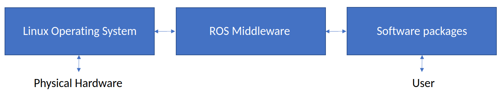

# SOLITUDE Project Resources
This is the SOLITUDE project documentation repository, summarising and linking all resources. This repository serves as ducmentation for installing the simulator, getting access to the data for getting started and assurance tools developed for the SOLITUDE project. 

## Table of Contents
  - [Software](#software)
    - [ROS](#ros)
    - [Simulator](#simulator)
    - [Reliability tools](#reliability-tools)
  - [Data](#data)
  
## Software
The current version of software has been tested with **ROS Meoldic** in **Ubuntu 18.04 LTS**. It should also work fine with other versions of Ubuntu and ROS 1. However it is best to use an LTS Ubuntu version for long term OS support.

### ROS
Robot Operating System (ROS) is midddleware software that sits between the operating system and your project. It provided tools that can connect multiple application together and thus is particulary good for robotics application which tend to have intricate individual components. ROS can be considered as a communication backbone for interaction between multiple compoenents of robotics. 



For installation instruction on ROS on Ubuntu 18.04, please follow the instructions on http://wiki.ros.org/melodic/Installation/Ubuntu. Some other ROS tutorials can be found at http://wiki.ros.org/ROS/Tutorials, tutorial 1 to 4 would be particulary beneficial for users only wanting to install and run SOLITUDE Project. Rest of the tutorials would beneficial for anyone wanting to furthur develop software with ROS. 

An important tuturial is to understand [*catkin_workspace*](http://wiki.ros.org/catkin/workspaces). This is what ROS 1 uses for managing the ROS packages. This has been repalced by [*colcon_workspace*](https://docs.ros.org/en/foxy/Tutorials/Colcon-Tutorial.html) for ROS 2. 

#### Working with catkin workspace
Following commands will create a new folder and initialize the catkin workspace in *ros_solitude/src* folder. The `~/` implies user home folder in linux.
```bash
mkdir -p ~/ros_solitude/src
cd ~/ros_solitude/src
catkin_init_workspace
```

To compile the new catkin workspace created execute folwing in the toplevel directory of the workspace (`~/ros_solitude/`).
```bash
cd ~/ros_solitude
catkin_make
```

These commands will create two additional folders withing the workspace, `~/ros_solitude/build` and `~/ros_solitude/devel`.

#### Adding ROS and your workspace to linux environment
As mentioned earlier, ROS is a middleware and thus needs to be added into the environment. If [ROS installation](http://wiki.ros.org/melodic/Installation/Ubuntu) is successfull, open a terminal and execute following commands one by one. If the commands fail to run then the installation might not be done properly. 
```bash
source /opt/ros/melodic/setup.bash # For sourcing your ROS installtion
roscore # For running the ROS instance. 
```

Now we can add our catkin_workspace to the linux enviroment by executing, 
```bash
source ~/ros_solitude/devel/setup.bash
```

At this point we can confirm the ROS environment is configured properly by executing, 
```bash
$ROS_PACKAGE_PATH
```
which should show follwing output:
```
/home/user_name/ros_solitude/src:/opt/ros/melodic/share
```

#### Adding ROS/Workspace to bashrc
Once the initial installtion checks are done, it is good idea to add the sourcing commands to your `bashrc` file as to not execute these commands everytime a new terminal window is open. Use any editor of choice to add these commands to your bash file. We will *gedit* here. Execeute following to open the bashrc file:
```bash
gedit ~/.bashrc
```

and add follwoing lines at the bottom of the file. Then save and close the window. 
```bash
source /opt/ros/melodic/setup.bash      # For sourcing your ROS installtion. 
source ~/ros_solitude/devel/setup.bash  # For sourcing your catkin workspace. 
git config --global credential.helper 'cache --timeout=3600'
```

The last *git* command is useful when working with multiple private git repositories without having to put password again. To make sure everything is successful, open a new terminal windows and run `roscore` again. 

### Simulator
For installing the simulator, first install create and add the catkin workspace *ros_solitude*. Then clone this repository within *ros_solitude/src* folder. Use these commands in a terminal for doing so,
```bash
cd ~/ros_solitude/src/
git clone https://github.com/Solitude-SAMR/master_samr
```

To clone all the packages required for running the simuator use command provided below. You can clone the repositories individually as well. 
```bash
cd ~/ros_solitude/src/
sh master_samr/repos_clone.sh
```

The simulator will not work yet as it needs *uuv_simulator* ROS packages to be installed first. Use the command below to install this and some more dependencies to make it work,
```bash
sudo apt install ros-melodic-uuv-simulator
sudo apt install ros-melodic-vision-msgs
```
More in-depth installation instructions for *uuv_simulator* can be found at https://uuvsimulator.github.io/installation/. Finally compile the workspace one more time,
```bash
cd ~/ros_solitude/
catkin_make
```

#### Individual ROS packages:
- [OSL Underwater Simulator](https://github.com/Solitude-SAMR/osl_simulator)
- [Gazebo Models of Ocean Systems Lab Tanks](https://github.com/Solitude-SAMR/osl_worlds)
- [BlueROV2 ROS Simulation and Control](https://github.com/Solitude-SAMR/bluerov2)
- [Detection Network](https://github.com/Solitude-SAMR/osl_network)
- [Projection](https://github.com/Solitude-SAMR/projection.git)

#### Running the Simulator
To run the simulator, open a terminal windows and execute this commands, 
```bash
roslaunch osl_simulator osl_wavetank.launch
```
In another terminal run following commands to run a predefince waypoint route. 
```bash
roslaunch osl_simulator send_waypoints.launch
```

### Reliability tools

## Data
-  Need links to the current data (especially for testing software packages). 

## Quickstart Cheat Sheet!
If you are an advanced user, use these commands to quickly install the full system and dependencies on fresh Ubuntu 18.04 installation. But first, get ROS in your repositories. Use this [link](http://wiki.ros.org/melodic/Installation/Ubuntu) to get the updated sources (step 1.2 and 1.3). After adding the sources, run following commands one by one and keep an eye out for errors. 

If the ROS sources doesn't work when doing a `sudo apt update` use the following commands to fix the issues. 

```bash
sudo apt-key del OLD_KEY
sudo -E apt-key adv --keyserver 'hkp://keyserver.ubuntu.com:80' --recv-key C1CF6E31E6BADE8868B172B4F42ED6FBAB17C654
```

Rest of the commands should have no known issues in installation. 
```bash
sudo apt update
sudo apt install ros-melodic-desktop-full
sudo apt install git gedit
sudo apt install ros-melodic-vision-msgs
sudo apt install ros-melodic-uuv-simulator

echo "" >> ~/.bashrc
echo "# Custom bash commands" >> ~/.bashrc
echo "source /opt/ros/melodic/setup.bash" >> ~/.bashrc
source ~/.bashrc

mkdir -p ~/ros_solitude/src
cd ~/ros_solitude/src
catkin_init_workspace

cd ~/ros_solitude
catkin_make
echo "source ~/ros_solitude/devel/setup.bash" >> ~/.bashrc
echo "git config --global credential.helper 'cache --timeout=3600'" >> ~/.bashrc
source ~/.bashrc

cd ~/ros_solitude/src/
git clone https://github.com/Solitude-SAMR/master_samr
sh master_samr/repos_clone.sh

cd ~/ros_solitude/
catkin_make

roslaunch osl_simulator osl_wavetank.launch
```

### Working with multiple git repos. 
The `master_samr` repository is provided with `repos_cmd.sh` script that can help working with multiple repositories at the same time. It is best to use it if you have an idea of git works. First make the script executable and make a symlink of the script in your '~/ros_solitude/src/' folder. 
```bash
cd ~/ros_solitude/src/
chmod +x master_samr/repos_cmd.sh
ln -s master_samr/repos_cmd.sh repos_cmd
```

Then you can execute any git command on all the git repositories withing the `src` folder by using following example commands:
```bash
cd ~/ros_solitude/src/
./repos_cmd 'fetch'
./repos_cmd 'pull'
./repos_cmd 'push'
./repos_cmd 'push origin master'
```

**Do not** use this script for important commands like `merge` and `commit`. This script is useful to keep the repositories updated. 

## Contacts
- ROS Related: vb97@hw.ac.uk; bvibhav@yahoo.co.in
- Assurance: xingyu.zhao@liverpool.ac.uk
- General: xiaowei.huang@liverpool.ac.uk; S.Wang@hw.ac.uk

#### TODO:
- Cross-validate on another machine. Someone with least ROS experience. 
